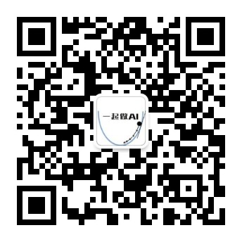

## Udacity深度学习试学班

### 打卡格式
 Day1 -学号
 问题：
 答案:
 @助教 @班主任
 
### Anaconda安装配置
https://github.com/udacity/AIPND-cn-trial

### 官网课程
https://classroom.udacity.com/me

### 每日一题
https://github.com/panthole/DLND

### 项目地址
https://github.com/CheneyZeng/ai_guess

### 每日一题答案
https://shimo.im/sheet/7DQtgR8gKEY6FvOr/RIDOC

### 直播课回看地址
https://www.eeo.cn/webcast.php?courseKey=f4f0792c5699523e

### 知识点
一、核心概念
1.感知器
2.非线性
3.多类别分类和softmax
4.one-hot 
5.交叉熵公式
6.逻辑回归 线性回归
7.梯度下降 loss 导数连法则
8.神经网络架构=前向反馈+反向传播

二、项目讲解

三、有趣项目及比赛

### 获取更多资料

